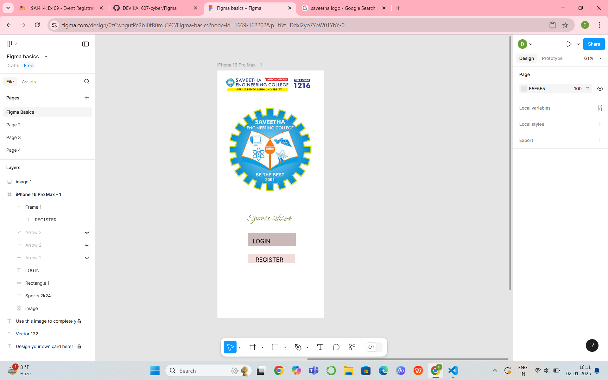

# Ex09 Event Registration Web Application
## Date:

## AIM:
To design, develop and deploy a web application for event registration.

## DESIGN STEPS:

### Step 1:
Create a new frame.

### Step 2:
Select any one preset size of your choice.

### Step 3:
Select the shapes you need.

### Step 4:
Import images as needed.

### Step 5:
Create pages based on your need and link them.

### Step 6:

Validate the HTML and CSS code.

### Step 6:

Publish the website in the given URL.

## DESIGN TOOL:
Figma

## CODE:
```
Home page
 <div class="container--0-">
  <div class="text-0-1-1">
    <br />
    Sports 2k24
  </div>
  <svg
    width="197"
    height="53"
    viewBox="0 0 197 53"
    fill="none"
    xmlns="http://www.w3.org/2000/svg"
  >
    <rect width="197" height="53" fill="#CBB8B8"></rect>
  </svg>
  <div class="text-0-1-3">LOGIN</div>
  <div class="container-0-1-7"><div class="text-1-2-0">REGISTER</div></div>
</div><svg
  width="272"
  height="147"
  viewBox="0 0 272 147"
  fill="none"
  xmlns="http://www.w3.org/2000/svg"
>
  <path
    d="M272 144C272 145.657 270.657 147 269 147C267.343 147 266 145.657 266 144H272ZM5.13105 46.2805C3.47578 46.3529 2.07524 45.0697 2.00286 43.4145L0.823413 16.4402C0.751036 14.785 2.03423 13.3844 3.6895 13.312C5.34477 13.2397 6.74531 14.5229 6.81769 16.1781L7.86609 40.1552L31.8432 39.1068C33.4984 39.0344 34.899 40.3176 34.9714 41.9729C35.0437 43.6282 33.7605 45.0287 32.1053 45.1011L5.13105 46.2805ZM266 144C266 106.401 253.876 77.1622 234.796 55.4753C215.683 33.7495 189.449 19.4474 161.04 12.0399C104.006 -2.83133 39.2939 10.2943 7.21196 45.31L2.78804 41.2568C36.8314 4.10022 104.119 -9.00264 162.554 6.23407C191.879 13.8806 219.247 28.7166 239.301 51.5121C259.39 74.3466 272 105.013 272 144H266Z"
    fill="black"
  ></path>
</svg>
page 2
<div class="container--0-">
<div class="text-0-1-1">
    VOLLEY BALL<br />BASKET BALL<br />THROW BALL<br />HAND BALL<br />FOOT
    BALL<br />LONG JUMP<br />CRICKET
  </div>
  <div class="text-0-1-2">SPORTS DAY EVENTS</div>
</div>
page 3
<div class="container--0-">
<svg
    width="289"
    height="59"
    viewBox="0 0 289 59"
    fill="none"
    xmlns="http://www.w3.org/2000/svg"
  >
    <rect width="289" height="59" fill="#B44848"></rect>
  </svg>
  <div class="text-0-1-2">REGISTER NUMBER</div>
  <div class="text-0-1-3">EVENT REGISTRATION FORM<br /><br /></div>
  <svg
    width="289"
    height="65"
    viewBox="0 0 289 65"
    fill="none"
    xmlns="http://www.w3.org/2000/svg"
  >
    <rect width="289" height="65" fill="#C22C2C"></rect>
  </svg>
  <div class="text-0-1-5">NAME</div>
  <svg
    width="289"
    height="62"
    viewBox="0 0 289 62"
    fill="none"
    xmlns="http://www.w3.org/2000/svg"
  >
    <path d="M0 0H289V62H0V0Z" fill="#C83939"></path>
  </svg>
  <div class="text-0-1-7">GENDER</div>
  <svg
    width="289"
    height="60"
    viewBox="0 0 289 60"
    fill="none"
    xmlns="http://www.w3.org/2000/svg"
  >
    <path d="M0 0H289V33.6V60H0V0Z" fill="#B34040"></path>
  </svg>
  <div class="text-0-1-9">AGE</div>
  <svg
    width="289"
    height="59"
    viewBox="0 0 289 59"
    fill="none"
    xmlns="http://www.w3.org/2000/svg"
  >
    <rect width="289" height="59" fill="#AD4B4B"></rect>
  </svg>
  <div class="text-0-1-11">DEPARTMENT</div>
  <svg
    width="289"
    height="58"
    viewBox="0 0 289 58"
    fill="none"
    xmlns="http://www.w3.org/2000/svg"
  >
    <rect width="289" height="58" fill="#B45353"></rect>
  </svg>
  <div class="text-0-1-13">MOBILE NUMBER</div>
  <svg
    width="289"
    height="61"
    viewBox="0 0 289 61"
    fill="none"
    xmlns="http://www.w3.org/2000/svg"
  >
    <rect width="289" height="61" fill="#A05252"></rect>
  </svg>
  <div class="text-0-1-15">EMAIL ID</div>
  <svg
    width="289"
    height="60"
    viewBox="0 0 289 60"
    fill="none"
    xmlns="http://www.w3.org/2000/svg"
  >
    <rect width="289" height="60" fill="#A36262"></rect>
  </svg>
  <div class="text-0-1-17">EVENT TO REGISTER</div>
  <svg
    width="400"
    height="44"
    viewBox="0 0 400 44"
    fill="none"
    xmlns="http://www.w3.org/2000/svg"
  >
    <rect width="400" height="44" fill="#DEF654"></rect>
  </svg>
  <div class="text-0-1-19">REGISTER</div>
</div>
page 4
<div class="text--0-">THANK YOU<br /><br /></div>
<div class="text--0-">
  Be ready to participate and win the amazing prizes waiting for you
</div>
<svg
  width="238"
  height="61"
  viewBox="0 0 238 61"
  fill="none"
  xmlns="http://www.w3.org/2000/svg"
>
  <rect width="238" height="61" fill="#5E8390"></rect>
</svg>
<div class="text--0-">contact us</div>
<div class="text--0-">6789054321</div>
<div class="text--0-">sec@gmail.com</div>
```

## OUTPUT:
```


c:\Users\admin\Pictures\Screenshots\Screenshot (80).png
c:\Users\admin\Pictures\Screenshots\Screenshot (81).png
```

## RESULT:
The program to design, develop and deploy a web application for event registration is completed successfully.
